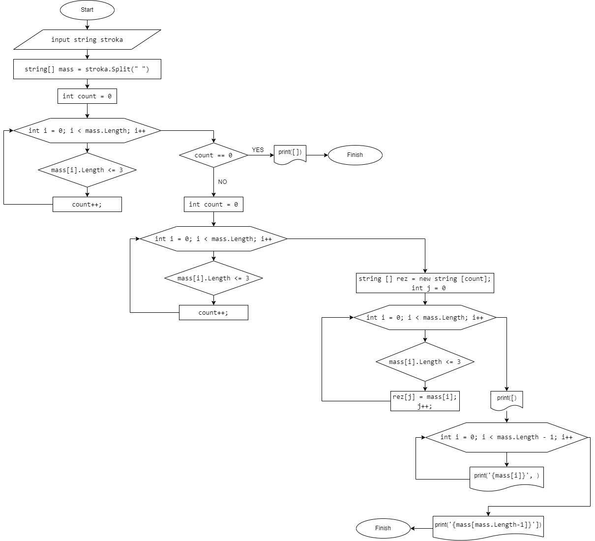

Вы читаете файл readme.md.  
Данный файл содержит задачу для выполнения контрольной работы, блок-схему алгоритма, подробное описание работы кода программы и ее результат.

# Итоговая контрольная работа по основному блоку
### Задача
    Написать программу, которая из имеющегося массива строк формирует новый массив  
    из строк, длина которых меньше, либо равна 3 символам. Первоначальный массив  
    можно ввести с клавиатуры, либо задать на старте выполнения алгоритма. При   
    решении не рекомендуется пользоваться коллекциями, лучше обойтись исключительно  
    массивами.  
### Примеры:
    [“Hello”, “2”, “world”, “:-)”] → [“2”, “:-)”]
    [“1234”, “1567”, “-2”, “computer science”] → [“-2”]
    [“Russia”, “Denmark”, “Kazan”] → []

## Блок-схема алгоритма:
  

## Код программы:
Программа находится на ветке `main`. Написана на языке C#.

```C#
//1. Вводим строку с консоли:
Console.WriteLine ("1. Введите элементы массива через ПРОБЕЛ:");
string stroka = Console.ReadLine()!;
Console.WriteLine ();

//2. Преобразуем введенную строку в строковый массив, вывод на экран оформляем, как по примеру:
string[] mass = stroka.Split(" ");  // Разделяем слова введенной строки пробелами

//Выведем для СВОЕГО удобства сформированный строковый массив (данная часть кода не отображена на блок-схеме):
Console.WriteLine($"2. Сформированный массив из строк:");
Console.Write($"[");
for (int i = 0; i < mass.Length - 1; i++)  // Перебор исходного массива по элементам
{
    Console.Write($"'{mass[i]}', ");
}
Console.WriteLine($"'{mass[mass.Length-1]}']");
Console.WriteLine();
/*
2.1 Можно проверить любой элемент строкового массива, для этого нужно  
раскомментировать следующие 3 строки и задать необходимый индекс элемента.  
Индекс элемента считается от 0 до mass.Length-1.
*/
// Console.Write($"    2.1 Элемент №3 новой строки = ");
// Console.WriteLine($"{mass[3]}");
// Console.WriteLine();

//3. Воспользуемся функцией для определения элементов, удовлетворяющих условию задачи:
string [] EndMass(string [] mass)
{
    int count = 0; //количество элементов в новом массиве

//Цикл для определения количества элементов в новом массиве
    for (int i = 0; i < mass.Length; i++)
    {
        if(mass[i].Length <= 3) // если условие выполняется, то увеличиваем счетчик элементов
        {count++;}
    }

    string [] rez = new string [count]; //Создадим новый нулевой массив из строк размерностью count
    int j = 0; // обнулим количество элементов нового массива, чтобы записывать в него элементы начиная с нулевой позиции

// Цикл для заполнение нового массива элементами из старого массива, 
// которые удовлетворяют условию:
    for (int i = 0; i < mass.Length; i++)
    {
        if(mass[i].Length <= 3)  // если условие выполняется, то записываем элемент в новый массив
        {
            rez[j] = mass[i];
            j++;
        }
    }
    return rez;
}

//4. Зададим функцию для вывода красивого результата, как по примеру:
void PrintArray(string [] mass)
{
    Console.WriteLine($"3. Строковый массив из элементов удовлетворяющих условию:");
    Console.Write("[");
    for (int i = 0; i < mass.Length - 1; i++)
    {
    Console.Write($"'{mass[i]}', ");
    }
    Console.WriteLine($"'{mass[mass.Length-1]}']");
    Console.WriteLine();
    // //4.1 Можно проверить любой элемент строкового массива
    // Console.Write($"    3.1 Элемент №2 новой строки = ");
    // Console.WriteLine($"{mass[2]}");
    // Console.WriteLine();
}

    PrintArray(EndMass(mass));
```
## Реализация кода программы:


